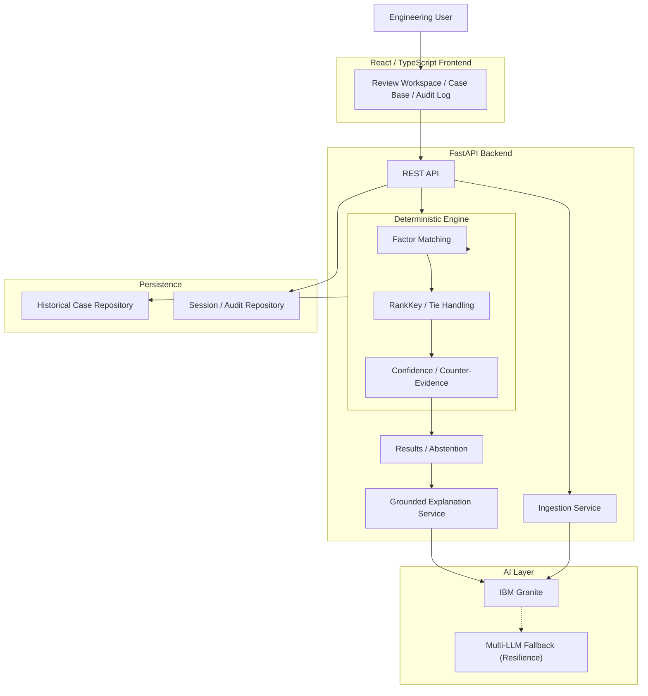

# PRECEDENT
**Deterministic Aerospace Precedent Analysis & Grounded Synthesis**

PRECEDENT is an aerospace flight-readiness decision-support system that compares current mission situations against verified historical incidents using a deterministic 8-factor reasoning engine, and uses IBM Granite for grounded explanation and narrative synthesis.

---

## 1. THE PROBLEM
Aerospace engineering teams face high-stakes situations during Flight Readiness Reviews (FRR) involving unresolved technical issues, degraded safety margins, and schedule pressure. 

Conventional keyword search, generic RAG, and opaque AI similarity scores are insufficient. The actual problem is: **How can an engineering team systematically identify whether a flight-readiness situation structurally resembles historical aerospace incidents, without relying on opaque similarity scores and hallucinated reasoning?**

---

## 2. THE SOLUTION
PRECEDENT solves this by strictly separating deterministic decision logic from generative explanation. 

**Current Mission Situation**
↓
**8 Canonical Risk Factors**
↓
**Deterministic Matcher**
↓
**RankKey**
↓
**Primary / Tied Precedents**
↓
**Confidence & Counter-Evidence**
↓
**IBM Granite Grounded Synthesis**
↓
**Engineer Review & Sign-Off**
↓
**Immutable Audit Log & Replay**

**Architectural Boundary:** 
- AI assists with extracting structured factors from unstructured input.
- Engineers confirm and finalize those factors.
- The deterministic engine performs precedent matching, ranking, tie handling, confidence, counter-evidence, and abstention.
- IBM Granite provides grounded explanation and narrative synthesis.
- The engineer remains responsible for review and sign-off.

---

## 3. WHY DETERMINISTIC DECISION LOGIC?
PRECEDENT deliberately avoids:
- LLM similarity as the ranking authority
- Arbitrary vector similarity thresholds
- Opaque similarity scores
- Generative model judgment as the final decision

Deterministic ranking provides reproducibility, explainability, auditability, consistent results, explicit tie handling, and traceable factor-level reasoning.

*Note: PRECEDENT provides decision support. It does not make autonomous flight decisions or certifications.*

---

## 4. CORE REASONING MODEL

### The 8 Canonical Factors
Situations are evaluated against 8 canonical risk factors across 4 distinct categories:

**Technical State:**
- Known Unresolved Issue
- Safety Margin Degraded

**Decision Environment:**
- Schedule Pressure
- External Conditions Marginal

**Human Factors:**
- Dissent Raised and Overridden
- Missing Evidence Acknowledged

**Process Quality:**
- Prior Normalization of Risk
- Independent Review Skipped

### Deterministic Matching
Precedent matching operates over `VERIFIED` canonical cases. Key concepts:
- **Factor Overlap:** Shared active factors.
- **Category Breadth:** Ensures matches span multiple risk domains.
- **Historical Overmatch:** Penalizes precedents where historical factors are active but absent currently.
- **Primary / Tied Matches:** Explicit top-ranked results.

### RankKey & Exact Tie Handling
The deterministic matcher ranks using an explicit mathematical tuple:
`(overlap_score, category_breadth, -historical_overmatch, score_org)`

Ties are handled explicitly. If two cases yield identical tuples, the system returns **TIED PRIMARY PRECEDENTS**.

### Confidence, Counter-Evidence & Abstention
- **Confidence:** A discrete level, overlap metric, and rationale for decision-support context.
- **Counter-Evidence:** Identifies historically relevant cases that resulted in divergent corrective actions (e.g., safe recoveries).
- **Abstention:** Returns "no-strong-precedent" when factor overlap is insufficient.

---

## 5. IBM GRANITE & AI ROLE

**AI DOES:**
- Assist with extracting structured factors from unstructured mission reports.
- Generate grounded explanations and narrative synthesis.

**AI DOES NOT:**
- Determine precedent ranking.
- Modify the RankKey.
- Determine confidence, counter-evidence, or abstention.
- Replace deterministic reasoning.

Multi-LLM fallback providers are available for resilience infrastructure only, and never serve as reasoning authorities.

---

## 6. AUDITABILITY & SIGN-OFF

### Factor Provenance
The system meticulously distinguishes between AI-extracted values, engineer-confirmed/final values, and user modifications.

### Persisted Decision Context
Session records persist the rich analysis context, including matched cases/IDs, overlap, tie information, confidence, counter-evidence, abstention details, grounded explanation, and AI model/provider identity.

### Immutable Sign-Off
After an engineer signs off:
- The audit action cannot be overwritten.
- Duplicate sign-offs are rejected.
- Protected post-sign-off mutations are rejected with HTTP 409 (backend-enforced immutability).

### Historical Audit Replay
Users can open an Audit Log entry and view a read-only historical replay. It fetches the stored session (without running a new evaluation), displays the persisted historical context, and presents a read-only sign-off state.

### Legacy Compatibility
Older sparse session records remain readable because newly persisted audit fields are optional.

---

## 7. ARCHITECTURE



---

## 8. PROJECT STRUCTURE

```text
backend/
├── app/
│   ├── api/
│   ├── models/
│   ├── repositories/
│   └── services/
│       ├── ai/
│       └── engine/
├── data/
└── tests/

frontend/
└── src/
    ├── components/
    ├── lib/
    └── types/

docs/
```

---

## 9. TECH STACK

| Layer | Technology |
|---|---|
| Frontend | React, TypeScript, Vite, Tailwind CSS |
| Backend | Python, FastAPI, Pydantic |
| Decision Engine | Custom deterministic ranking engine |
| Primary AI | IBM watsonx, IBM Granite |
| AI Resilience | Multi-LLM provider fallback |
| Document Processing | pypdf |
| Storage | JSON repository (`cases.json`) |
| Testing | pytest, TypeScript compiler, Vite build |
| Development Ecosystem | IBM Bob |

---

## 10. RUNNING LOCALLY

### Backend
```bash
cd backend
python -m venv .venv
source .venv/bin/activate
pip install -r requirements.txt
cp .env.example .env
uvicorn app.main:app --reload --port 8000
```

### Frontend
```bash
cd frontend
npm install
npm run dev
```

---

## 11. TESTING
**Backend:** (Covers deterministic invariants, API, persistence, and audit behavior)
```bash
cd backend
pytest
```
**Frontend:**
```bash
cd frontend
npm run build
```

---

## 12. USE CASES
- Flight Readiness Reviews (FRR)
- Launch Readiness Reviews (LRR)
- Anomaly Review Boards (ARB)
- Engineering risk reviews
- Historical incident comparison
- Safety/engineering review preparation

---

## 13. ROADMAP
- OCR for legacy scanned reports
- Richer provenance and citation storage
- PostgreSQL / Enterprise persistence
- Authentication and role-based access controls
- Additional verified aerospace corpora
- Configurable factor taxonomies
- Docker / CI/CD pipelines
