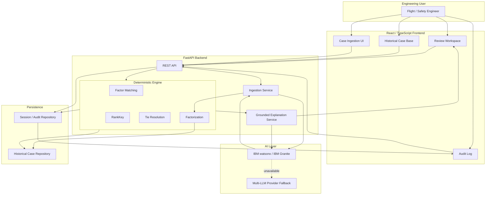
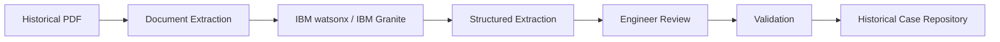
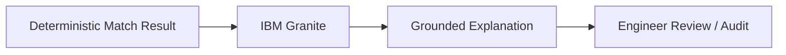

# PRECEDENT

**Deterministic Aerospace Precedent Analysis & Grounded Synthesis**

PRECEDENT is an aerospace flight-readiness decision-support system that compares a current mission situation against verified historical aerospace incidents using a deterministic 8-factor reasoning engine, and then uses IBM Granite to generate grounded explanations of the deterministic result.

---

## 1. THE PROBLEM

Aerospace engineering teams repeatedly face high-stakes situations during Flight Readiness Reviews (FRR) involving combinations of:
- Known unresolved technical issues
- Degraded safety margins
- Schedule pressure
- Marginal external conditions
- Engineering dissent
- Missing evidence
- Normalization of risk
- Skipped independent review

The problem is not simply "finding similar documents." Conventional keyword search, generic Retrieval-Augmented Generation (RAG), and opaque AI similarity scores are insufficient for this use case because they cannot guarantee reproducible, explainable, and accountable analysis. 

The actual problem is: **How can an engineering team systematically identify whether a current flight-readiness situation structurally resembles historically significant aerospace incidents, without relying on opaque AI similarity scores and hallucinated reasoning?**

---

## 2. OUR SOLUTION

PRECEDENT is a deterministic precedent-analysis system that solves this by strictly separating deterministic decision logic from generative explanation:

**Current Mission Situation**
↓
**8 Canonical Risk Factors**
↓
**Deterministic Matcher**
↓
**RankKey**
↓
**Primary / Tied Precedents**
↓
**Factor Comparison**
↓
**IBM Granite Grounded Synthesis**
↓
**Engineer Review**
↓
**Audit Log**

**Key Design Philosophy:** PRECEDENT does not ask an LLM to decide which historical incident is similar. It converts the current situation into a canonical set of risk factors, deterministically evaluates those factors against verified historical cases, ranks them using an explicit mathematical RankKey, and then uses IBM Granite to explain the already-established result.

---

## 3. WHY DETERMINISTIC DECISION LOGIC?

In aerospace decision support, the system deliberately avoids using:
- LLM similarity as the ranking authority
- Arbitrary vector similarity thresholds
- Opaque "87% similar" scores
- Generative model judgment as the final decision

Deterministic ranking provides:
- Reproducibility and predictability
- Explainability and auditability
- Consistent results
- Explicit tie handling
- Traceable factor-level reasoning

*Note: PRECEDENT provides decision support. It does not make autonomous flight decisions or certifications.*

---

## 4. THE 8 FACTORS

To compare structural risk mechanisms rather than simply matching words, PRECEDENT evaluates 8 canonical risk factors across 4 distinct categories:

### Technical State (`CAT_TECH`)
- **Known Unresolved Issue**
- **Safety Margin Degraded**

### Decision Environment (`CAT_ENV`)
- **Schedule Pressure**
- **External Conditions Marginal**

### Human Factors (`CAT_HUMAN`)
- **Dissent Raised and Overridden**
- **Missing Evidence Acknowledged**

### Process Quality (`CAT_PROCESS`)
- **Prior Normalization of Risk**
- **Independent Review Skipped**

---

## 5. HISTORICAL CASE INGESTION

Historical cases enter the system through two distinct, human-in-the-loop paths:

**PATH A — PDF:**
PDF → Text Extraction → IBM Granite extraction assistance → Structured Ingestion DTO → **Engineer Review** → Factor Validation → Validation → Duplicate Check → Historical Case Repository

**PATH B — MANUAL ENTRY:**
Manual metadata entry → **Engineer establishes factors** → Validation → Admission into Historical Case Repository

**Why Manual Entry Exists:** A historical incident may not always be available as a parseable PDF, or an engineer may already possess the required structured information. Manual entry must pass through the exact same rigorous validation and admission rules. Unresolved factors must remain unresolved until an engineer explicitly establishes them. AI must not invent missing evidence.

---

## 6. DETERMINISTIC MATCHER & RANKKEY

The deterministic matcher is the single source of truth for precedent ranking. The mathematical ranking tuple (`RankKey`) evaluates exactly:

`(overlap_score, category_breadth, -historical_overmatch, score_org)`

1. **`overlap_score`:** Measures shared active factor overlap. Preserves fractional values where applicable (e.g., partial schedule pressure match).
2. **`category_breadth`:** Measures how many distinct risk categories are represented. Prevents a match from appearing artificially strong merely because many factors come from a single category.
3. **`historical_overmatch`:** Represents historical factors active in the precedent but absent in the current situation. The ranking uses the negative value to penalize over-prediction.
4. **`score_org`:** Represents organizational failure characteristics. Cases involving overridden dissent or normalization of risk receive organizational weighting.

---

## 7. EXACT TIE HANDLING

The deterministic matcher handles ties explicitly. A historical case is designated a **primary precedent** only when its COMPLETE `RankKey` equals the top `RankKey`. 

If the full tuples match exactly:
- Case A: `(7.5, 4, 0, 2.0)`
- Case B: `(7.5, 4, 0, 2.0)`
**Result:** TIED PRIMARY PRECEDENTS

But if the fourth component (`score_org`) differs:
- Case A: `(7.5, 4, 0, 2.0)`
- Case B: `(7.5, 4, 0, 1.5)`
**Result:** NOT TIED. Case A strictly outranks Case B.

The system will never artificially select the first item simply because it appears first in the repository.

---

## 8. IBM WATSONX / IBM GRANITE

IBM Granite, accessed through the IBM watsonx AI path, provides extraction assistance and grounded narrative synthesis. It serves as the primary AI path.

**IBM Granite DOES:**
- Assist with extracting structured factors from unstructured historical reports.
- Identify exact evidence quotes supporting factors.
- Generate grounded explanations.
- Synthesize deterministic match results into readable engineering narratives.

**IBM Granite DOES NOT:**
- Determine precedent ranking.
- Modify the RankKey.
- Select the primary precedent.
- Override deterministic rules.
- Automatically admit cases.
- Invent evidence.

---

## 9. MULTI-LLM PROVIDER FALLBACK

PRECEDENT includes a provider abstraction that enables fallback across alternative LLM providers (such as Groq or Gemini) when the primary IBM watsonx / Granite path is unavailable. This fallback exists solely for resilience. The deterministic engine remains completely independent of which AI provider is used, and the fallback provider must never become the ranking authority.

---

## 10. ARCHITECTURE



### Ingestion Data Flow


### Explanation Data Flow


---

## 11. TECH STACK

| Layer | Technology |
|---|---|
| Frontend | React, TypeScript, Vite, Tailwind CSS |
| Backend | Python, FastAPI, Pydantic |
| Decision Engine | Custom deterministic ranking engine |
| Primary AI | IBM watsonx, IBM Granite |
| AI Resilience | Multi-LLM provider fallback |
| Document Processing | pypdf |
| Storage | JSON repository (`cases.json`) |
| Testing | pytest, TypeScript compiler, Vite build |
| Development Ecosystem | IBM Bob |

---

## 12. CASE BASE UX

The **Case Base** serves as the verified historical incident library. It stores both immutable verified historical cases and rigorously validated user-submitted manual cases. The UI exposes case metadata, full factor profiles, historical outcomes, and source/citation information within a searchable case library.

---

## 13. AUDITABILITY

PRECEDENT maintains an immutable audit trail around every session. The system records the input situation, extracted factor values, matched precedents, RankKey-derived primary/tied status, grounded explanations, and final reviewer decisions (e.g., Acknowledged vs Dismissed). The deterministic matcher remains the ultimate source of truth for the audit record.

---

## 14. SEARCH & SCALE UX

To ensure the system remains usable as the repository of cases and review sessions grows, the UI supports a scalable, searchable, and paginated Case Base library, alongside a searchable/filterable Audit Log.

---

## 15. USE CASES

**PRECEDENT provides aerospace decision support for:**
- Flight Readiness Reviews (FRR)
- Launch Readiness Reviews (LRR)
- Anomaly Review Boards (ARB)
- Engineering risk reviews
- Historical incident comparison
- Safety board preparation
- Engineering dissent analysis
- Lessons-learned systems
- Training and decision rehearsal

---

## 16. EXAMPLE

Consider a current review presenting **unresolved joint issues, degraded thermal margins, severe schedule pressure, and explicitly overridden engineering dissent.**

The deterministic engine evaluates this against the Case Base and mathematically derives a match with the **Space Shuttle Challenger** disaster. If the current situation yields an identical `RankKey` with another historical incident (e.g., Columbia), the system explicitly reports **TIED PRIMARY PRECEDENTS**. It will never artificially force one case over the other, instead presenting the precise factor divergences to the review board.

---

## 17. SETUP

### Backend Setup
```bash
cd backend
python -m venv .venv
source .venv/bin/activate
pip install -r requirements.txt

# Configure environment variables (refer to backend/.env.example)
cp .env.example .env

# Run development server
uvicorn app.main:app --reload --port 8000
```

### Frontend Setup
```bash
cd frontend
npm install
npm run dev
```

---

## 18. TESTING

The project maintains an official test suite verifying deterministic invariants, ranking logic, tie resolution, and schema validation.

**Backend:**
```bash
cd backend
pytest
```

**Frontend:**
```bash
cd frontend
npm run build
```

*(Note: Depending on your environment configuration, the multi-LLM provider fallback may report HTTP 404 errors during testing if access to specific fallback models is not provisioned. This is an environment configuration issue, not a failure of the application logic).*

---

## 19. ROADMAP

- OCR integration for legacy scanned engineering reports.
- Richer provenance and citation storage linked to specific page bounds.
- Enterprise database persistence (e.g., PostgreSQL).
- Real authentication, reviewer identity, and role-based access controls.
- Additional pre-verified aerospace incident corpora.
- Configurable factor taxonomies tailored to specific hardware architectures.
- Dockerized deployment and CI/CD pipelines.
