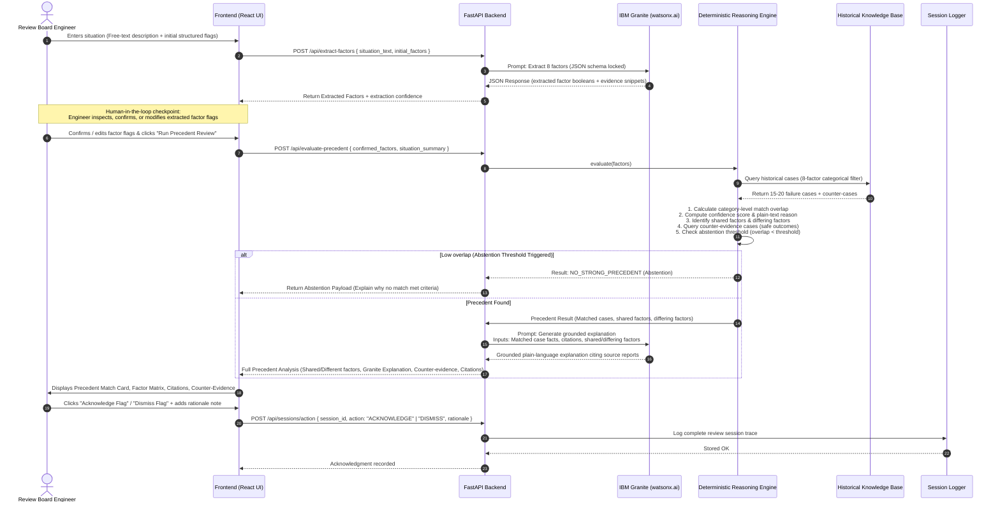

# PRECEDENT — Document 1: System Architecture

## 1. Executive Architectural Summary

PRECEDENT is an aerospace engineering decision-support system designed to challenge high-stakes engineering assumptions during flight readiness reviews (FRR), launch readiness reviews (LRR), and anomaly review boards (ARB). It proactively surfaces relevant historical incident precedents (such as Challenger, Columbia, Apollo 1, and DSS-14) before a review board commits to a risk-acceptance or GO/NO-GO decision.

### Architectural Tenet: The Strict AI-Deterministic Boundary
PRECEDENT enforces an uncompromising boundary between **deterministic engineering logic** and **generative AI (IBM Granite)**:
- **Deterministic logic owns:** Case indexing, multi-factor category comparison, candidate ranking, overlap scoring, confidence calculation, counter-evidence lookup, and abstention gating.
- **IBM Granite owns exclusively:** 
  1. Extracting structured factor tags from unstructured free-text situation descriptions.
  2. Synthesizing plain-language, grounded explanations of *why* the matched historical factors matter, strictly citing documented facts from historical investigation board reports.
- **The Human Engineer owns:** All decisions. The system provides historical precedent context and explicit factor comparisons; it never outputs GO/NO-GO recommendations or predicts mission outcomes.

```
┌────────────────────────────────────────────────────────────────────────┐
│                          PRECEDENT CORE BOUNDARY                       │
├──────────────────────────────────┬─────────────────────────────────────┤
│   DETERMINISTIC LOGIC (100%)     │         IBM GRANITE (AI)            │
├──────────────────────────────────┼─────────────────────────────────────┤
│ • Factor matching & comparison   │ • Free-text factor extraction       │
│ • Case ranking & filtering       │ • Grounded natural language         │
│ • Confidence computation         │   explanation synthesis             │
│ • Counter-evidence discovery     │ • Source report fact-referencing    │
│ • Abstention decision (no match) │                                     │
│ • Audit logging & persistence    │                                     │
└──────────────────────────────────┴─────────────────────────────────────┘
```

---

## 2. High-Level System Architecture

PRECEDENT is architected as a decoupled, single-service web application comprising:
1. **Presentation Layer (Frontend):** Modern React (Vite + TypeScript + Tailwind CSS/CSS Modules) delivering an engineering-grade, calm, typography-first review board interface.
2. **Application & API Layer (Backend):** Python 3.11+ FastAPI application providing synchronous REST endpoints, request validation, and pipeline orchestration.
3. **Core Engine Layer:**
   - **Reasoning Engine (Deterministic):** Multi-attribute categorical matching engine operating on an 8-factor fixed schema across 4 distinct categories.
   - **AI Layer (IBM Granite Integration):** `watsonx.ai` Python SDK integration with prompt engineering for schema-locked factor extraction and fact-grounded explanation synthesis.
4. **Data & Storage Layer:**
   - **Historical Knowledge Base:** Structured JSON/SQLite store containing 15–20 curated aerospace failure incidents + 3–5 counter-evidence cases (near-misses resolved safely).
   - **Review Session Store:** Append-only SQLite/JSON audit log recording reviewer inputs, extracted/modified factors, matched precedents, counter-evidence, and engineer acknowledge/dismiss actions.
   - **Vector Store (ChromaDB - Optional/Secondary):** Vector search is disabled by default and may only be enabled if it demonstrably improves retrieval while never influencing deterministic ranking.

```mermaid
flowchart TB
    subgraph Client ["Client Tier (React / Vite / TypeScript)"]
        UI_Form["1. Review Input Form\n(Structured + Free Text)"]
        UI_FactorReview["2. Factor Inspection & Override\n(Human-in-the-Loop)"]
        UI_Results["3. Precedent & Reasoning View\n(Shared vs Different Factors)"]
        UI_Counter["4. Counter-Evidence Panel\n(Safe Precedents)"]
        UI_Audit["5. Acknowledge / Dismiss Action\n(Audit Logging)"]
    end

    subgraph API ["API & Routing Tier (FastAPI)"]
        Router["FastAPI Application Router"]
        SchemaVal["Pydantic v2 Request/Response Validation"]
    end

    subgraph Services ["Service & Engine Tier"]
        ExtractSvc["Extraction Service\n(watsonx / Granite Client)"]
        ReasonEngine["Deterministic Reasoning Engine\n(Categorical Factor Matcher)"]
        ExplainSvc["Explanation Service\n(watsonx / Granite Grounding)"]
        AuditSvc["Audit & Session Service"]
    end

    subgraph AI ["IBM Foundation Model Layer"]
        GraniteExtract["IBM Granite 3.0 / 13B / 20B\n(Factor Extraction Mode)"]
        GraniteExplain["IBM Granite 3.0 / 13B / 20B\n(Grounded Explanation Mode)"]
    end

    subgraph Storage ["Data Tier"]
        CaseDB[("Historical Case Base\n(JSON / SQLite)\n15-20 Failures + 3-5 Counter")]
        AuditDB[("Review Session Store\n(SQLite / JSON Log)")]
        VectorDB[("Optional ChromaDB\n(Disabled by default;\nNever overrides deterministic)")]
    end

    %% Flow connections
    UI_Form -->|POST /api/extract-factors| Router
    Router --> SchemaVal
    SchemaVal --> ExtractSvc
    ExtractSvc -->|Prompt + JSON Schema| GraniteExtract
    GraniteExtract -->|Extracted Factors| ExtractSvc
    ExtractSvc -->|Return Extracted Factors| UI_FactorReview

    UI_FactorReview -->|POST /api/review-situation\n(Confirmed Factors)| Router
    Router --> ReasonEngine
    ReasonEngine <-->|Query Structured Cases| CaseDB
    ReasonEngine -.->|Optional Hybrid Similarity| VectorDB
    ReasonEngine -->|Matched Precedents + Differences| ExplainSvc
    ExplainSvc -->|Prompt + Case Facts + Factors| GraniteExplain
    GraniteExplain -->|Grounded Explanation| ExplainSvc
    ExplainSvc -->|Complete Analysis Result| UI_Results
    ReasonEngine -->|Counter-Cases| UI_Counter

    UI_Audit -->|POST /api/sessions/action\n(Acknowledge/Dismiss)| Router
    Router --> AuditSvc
    AuditSvc -->|Persist Decision Record| AuditDB
```

---

## 3. Communication & Data Flow Sequence

The review lifecycle follows a strict 6-stage pipeline. Every stage is transparent and inspectable by the engineer.



---

## 4. Module Decomposition & Responsibilities

### 4.1 Frontend Tier (Client Layer)
- **Technology:** React 18 / 19, TypeScript, Vite, Tailwind CSS, Lucide Icons.
- **Design Paradigm:** Calm, distraction-free, typography-driven engineering interface.
- **Core Components:**
  - `SituationInputForm`: Dual-input panel (unstructured situation description + direct categorical factor controls).
  - `FactorReviewModal / InlineTagEditor`: Explicit human-in-the-loop checkpoint displaying Granite's extracted tags alongside evidence quotes from the description, allowing the engineer to toggle any factor before matching.
  - `PrecedentCard`: Primary comparison view breaking down matches into **Shared Factors** (why it matched) and **Differing Factors** (how current situation differs).
  - `CounterEvidenceCard`: Surfaces historical missions facing similar risks that succeeded due to corrective action (e.g., independent review, extra qualification testing).
  - `ConfidenceIndicator`: Visual and text representation of match strength derived deterministically (e.g., *"High Confidence — 3 of 4 critical decision factors match: Known unresolved issue, Schedule pressure, Dissent raised"*).
  - `TrustPanel`: Discloses data sources, citations (e.g., Rogers Commission Report, CAIB Report), missing information warnings, and the mandatory "Second Opinion" disclaimer.
  - `ReviewAuditBar`: Interactive footer with explicit **Acknowledge** and **Dismiss** controls with optional rationale capture.

### 4.2 Backend Tier (FastAPI Service)
- **Technology:** Python 3.11+, FastAPI, Pydantic v2, Uvicorn.
- **Architecture:** Clean Service-Repository pattern with explicit dependency injection.
- **Service Modules:**
  - `ExtractionService`: Formulates structured prompts for IBM Granite, enforces strict JSON schema decoding, and returns extracted factors with reasoning snippets.
  - `ReasoningEngine`: Pure deterministic service executing the 8-factor matching algorithm across 4 categories (`Technical State`, `Decision Environment`, `Human Factors`, `Process Quality`).
  - `ExplanationService`: Constructs grounded prompts injecting verified historical facts from the matched case and instructs IBM Granite to explain the analogy without hallucinating new facts.
  - `CaseRepository`: Manages queries against the structured historical case library (`cases.json` / SQLite).
  - `AuditSessionRepository`: Persists review sessions and human decisions (`sessions.json` / SQLite).

### 4.3 AI Integration Layer (IBM Granite)
- **SDK:** `ibm-watsonx-ai` Python SDK or direct watsonx REST API.
- **Model Target:** `ibm/granite-3-8b-instruct` or `ibm/granite-13b-instruct-v2` / `ibm/granite-20b-multilingual`.
- **Role Isolation:**
  - **Call 1 (Extraction):** Free-text -> Pydantic-constrained JSON containing the 8 factors with boolean flags and brief excerpt justifications.
  - **Call 2 (Grounded Explanation):** Inputs: `{ current_situation, matched_case_data, shared_factors, differing_factors, source_citation }` -> Outputs: A 3-paragraph plain-language engineering analogy explaining how the historical risk mechanism relates to the current situation.
- **Prompt Safety Guardrails:** Strict zero-shot/few-shot system prompts with temperature=0.0 to guarantee deterministic extraction and grounded explanation.

### 4.4 Data Layer
- **Structured Knowledge Base (`data/cases.json`):**
  - 15–20 real aerospace failure cases (Challenger STS-51-L, Columbia STS-107, Apollo 1 / AS-204, Mars Climate Orbiter, Mars Polar Lander, Starliner OFT-1, DSS-14 Antenna Over-rotation 2026, Genesis Sample Return, Titan IV B-32 Centaur, etc.).
  - 3–5 counter-evidence cases (e.g., STS-27 Atlantis safe return, Apollo 13 ground recovery, Apollo 14 docking anomaly resolved, CRS-1 Dragon engine anomaly abort mode).
  - Schema: Metadata (Name, Date, Mission/Program, Source Report, Public URL), Summary, Categorized 8-factor booleans, Key Decision Points, and Prevention Takeaways.
- **Session Audit Store (`data/sessions.db` / `data/sessions.json`):**
  - Session UUID, timestamp, reviewer inputs, AI-extracted factors, human-edited factors, matched precedent IDs, confidence scores, Granite explanations, and final human action (`ACKNOWLEDGED` / `DISMISSED` + notes).

---

## 5. State Ownership Model

To ensure zero ambiguity during implementation, state ownership across the layers is strictly partitioned:

| Layer | Responsibility | State Lifetime & Nature |
| :--- | :--- | :--- |
| **Frontend** | **UI State Only** | Ephemeral: Form text inputs, draft factor toggles, modal open/close states, active tab, UI loading skeletons, local client-side validation errors. |
| **Backend** | **Business Logic & Pipeline State** | Request-scoped: Pydantic DTO validation, factor matching execution, prompt construction, confidence calculation, counter-evidence linking. |
| **Historical Case Store** | **Authoritative Ground Truth** | Immutable at runtime: Curated 15–20 failure cases + 3–5 counter-cases with verified citations and locked 8-factor tags. |
| **Audit Store** | **Review History & Audit Trail** | Append-only persistent: Complete trace of situation inputs, confirmed factors, matched precedents, generated explanations, and final human acknowledge/dismiss actions. |

---

## 6. Failure & Fallback Paths

In strict alignment with the Kill Criteria in the Project Constitution, PRECEDENT defines explicit, graceful degradation paths for every potential runtime failure:

| Failure Mode | Root Cause / Trigger | System Fallback Behavior |
| :--- | :--- | :--- |
| **Granite Factor Extraction Fails** | watsonx timeout, API rate limit, or unparseable JSON | UI informs user cleanly and transitions to **Manual Factor Entry Mode**, allowing the engineer to directly select the 8 structured factors. The core deterministic reasoning engine remains 100% operational. |
| **No Historical Precedent Found** | Scenario factor overlap count is below the minimum abstention threshold | System safely abstains: displays explicit **"No Strong Historical Precedent Found"** banner, explains why no cases met threshold, and lists the closest partial factors without forcing a false analogy. |
| **Granite Explanation Fails** | watsonx service outage or generation error | System gracefully bypasses the natural language narrative and directly displays the **Deterministic Match Breakdown** (Shared Factors vs. Differing Factors matrix, confidence count, and source report citations). |
| **Optional Vector Search Unavailable** | ChromaDB init error or dependency missing | System bypasses vector indexing entirely and executes **pure deterministic factor matching** with zero degradation in core functionality. |
| **Session Persistence / Audit Fails** | SQLite file lock or write permission error | Backend catches the error, returns the review result with a non-fatal warning header, and frontend offers a **"Download Local Audit JSON"** fallback so no engineer review record is lost. |

---

## 7. Non-Functional Requirements (NFRs)

1. **Explainability & Traceability:**
   - Every AI-generated output must be 100% traceable to documented historical facts and source reports (e.g., Rogers Commission, CAIB).
   - The UI must always display the explicit factor overlap count and plain-language justification rather than an opaque score.
2. **Reliability & AI-Independence:**
   - The core decision-support value (factor matching, shared/differing factors, counter-evidence) must operate independently of generative AI.
   - If IBM Granite is unreachable, the system continues to serve engineering review boards deterministically.
3. **Performance & Latency:**
   - Deterministic matching latency: `< 15ms`.
   - Total end-to-end review latency (including IBM Granite extraction and grounded explanation): `< 3.0 seconds` for MVP workflows.
4. **Offline & Degraded Resilience:**
   - Standalone offline execution capable: When external AI connectivity is severed, manual factor selection + deterministic matching execute entirely locally.
5. **Data Integrity & Trust:**
   - Zero fabricated citations, zero ungrounded conclusions. All historical facts must map to verified investigation board reports.

---

## 8. Deployment Topology

PRECEDENT is designed as a self-contained, lightweight architecture for local and cloud deployment:

```
[ Engineer Browser ]
        │  (HTTP / HTTPS)
        ▼
[ React Frontend (Vite Static Bundle / Nginx / Dev Server) ]
        │  (REST API / JSON)
        ▼
[ FastAPI Backend (Python 3.11+ / Uvicorn) ]
        ├─── (REST / HTTPS) ───► [ IBM watsonx.ai (IBM Granite) ]
        │
        └─── (Local File I/O) ──► [ SQLite / JSON Storage (Cases & Sessions) ]
```

- **Client:** Modern web browser running React single-page application.
- **Application Server:** Single Python FastAPI process serving REST APIs and orchestrating the pipeline.
- **AI Infrastructure:** Managed IBM watsonx.ai cloud endpoint executing IBM Granite models for extraction and grounded explanation.
- **Storage:** Local filesystem-backed SQLite / flat JSON files for zero-configuration, zero-cost, highly reliable local or containerized deployment.

---

## 9. Detailed Component & File Layout

```
precedent/
├── backend/
│   ├── app/
│   │   ├── api/                     # API route controllers
│   │   │   ├── v1/
│   │   │   │   ├── extract.py       # POST /api/v1/extract-factors
│   │   │   │   ├── evaluate.py      # POST /api/v1/evaluate-precedent
│   │   │   │   ├── cases.py         # GET /api/v1/cases, GET /api/v1/cases/{id}
│   │   │   │   └── sessions.py      # POST /api/v1/sessions, POST /api/v1/sessions/{id}/action
│   │   ├── core/                    # Core configuration & logging
│   │   │   ├── config.py            # Environment settings (watsonx API keys, project ID)
│   │   │   └── logging.py           # Structured JSON logger
│   │   ├── models/                  # Pydantic schemas (Domain & DTOs)
│   │   │   ├── factors.py           # 8-factor schema definitions & categories
│   │   │   ├── case.py              # Historical case schema
│   │   │   ├── review.py            # Review request / response models
│   │   │   └── session.py           # Audit session models
│   │   ├── services/                # Business logic layer
│   │   │   ├── ai/
│   │   │   │   ├── watsonx_client.py   # watsonx.ai client wrapper
│   │   │   │   ├── extraction_service.py # Granite factor extraction
│   │   │   │   ├── explanation_service.py# Granite grounded explanation
│   │   │   │   └── prompts.py          # Locked system & user prompt templates
│   │   │   ├── engine/
│   │   │   │   ├── matcher.py          # Deterministic 4-category 8-factor comparison
│   │   │   │   ├── confidence.py       # Confidence derivation logic
│   │   │   │   ├── counter_evidence.py # Counter-evidence discovery logic
│   │   │   │   └── abstention.py       # Abstention threshold evaluator
│   │   │   └── audit/
│   │   │       └── session_service.py  # Session persistence and audit logging
│   │   ├── repositories/            # Data access layer
│   │   │   ├── case_repository.py   # Load and query structured case base
│   │   │   └── session_repository.py# Load and write session audit records
│   │   └── main.py                  # FastAPI application entrypoint
│   ├── data/
│   │   ├── cases.json               # Seed historical failure & counter-cases
│   │   └── schema.json              # Factor schema definition
│   ├── tests/
│   │   ├── test_engine_matcher.py   # Deterministic unit tests (100% deterministic)
│   │   ├── test_confidence.py       # Confidence scoring tests
│   │   ├── test_abstention.py       # Abstention threshold tests
│   │   └── test_api.py              # FastAPI endpoint integration tests
│   ├── requirements.txt             # Python dependencies
│   └── .env.example                 # Environment template
│
├── frontend/
│   ├── src/
│   │   ├── api/                     # Backend API client
│   │   │   ├── client.ts            # Typed fetch wrapper
│   │   │   └── endpoints.ts         # Endpoint definitions
│   │   ├── components/              # UI components
│   │   │   ├── layout/
│   │   │   │   ├── Header.tsx       # System header & status
│   │   │   │   └── TrustBanner.tsx  # Non-recommendation & second-opinion badge
│   │   │   ├── review/
│   │   │   │   ├── SituationForm.tsx# Situation description & structured fields
│   │   │   │   ├── FactorEditor.tsx # Interactive factor verification / override
│   │   │   │   ├── PrecedentCard.tsx# Matched precedent & factor breakdown
│   │   │   │   ├── FactorMatrix.tsx # Shared vs differing visual matrix
│   │   │   │   ├── CounterCard.tsx  # Counter-evidence display
│   │   │   │   └── AuditAction.tsx  # Acknowledge / Dismiss controls
│   │   │   ├── common/
│   │   │   │   ├── Badge.tsx
│   │   │   │   ├── CitationLink.tsx # Clickable official report link
│   │   │   │   └── ConfidenceMeter.tsx
│   │   │   └── history/
│   │   │       └── SessionHistory.tsx # Past review session logs
│   │   ├── types/                   # TypeScript interfaces matching backend models
│   │   │   ├── factors.ts
│   │   │   ├── case.ts
│   │   │   └── review.ts
│   │   ├── App.tsx                  # Main review workflow orchestrator
│   │   ├── index.css                # Typography, CSS tokens & styling
│   │   └── main.tsx                 # Entrypoint
│   ├── package.json
│   ├── tsconfig.json
│   └── vite.config.ts
```

---

## 10. Design Decisions & Trade-off Analysis

### Decision 1: Pure Deterministic Matching vs. Vector RAG Search
- **Chosen:** Deterministic 8-factor categorical comparison as the primary retrieval and ranking mechanism. Vector search is disabled by default and may only be enabled if it demonstrably improves retrieval while never influencing deterministic ranking.
- **Rationale:** Naive RAG embeds superficial semantics. An antenna over-rotation incident and an SRB O-ring blow-by share virtually zero textual similarity, yet share identical causal decision factors (*unresolved known risk accepted, dissenting engineer overruled under schedule pressure*). Deterministic feature comparison matches on causal anatomy, ensuring 100% explainability.
- **Trade-off:** Requires hand-curating and tagging 15–20 historical cases upfront. This is front-loaded in Week 1, creating a defensible moat and zero runtime hallucination in matching.

### Decision 2: Decoupling Factor Extraction from Explanation Generation
- **Chosen:** Two distinct, single-purpose Granite calls with a human-in-the-loop validation step in between.
- **Rationale:** A monolithic end-to-end LLM prompt ("read situation, pick case, explain why") is an un-inspectable black box prone to hallucination. By separating extraction, the engineer inspects and verifies the extracted factors *before* the engine matches cases. The second Granite call receives verified historical facts and only synthesizes the contextual narrative.
- **Trade-off:** Adds one sequential round-trip API call (~1.5s latency), but gains 100% auditability and user trust.

### Decision 3: Fixed 4-Category, 8-Factor Schema vs. Open-Ended Tagging
- **Chosen:** A strictly capped 8-factor schema (2 factors per category: Technical State, Decision Environment, Human Factors, Process Quality).
- **Rationale:** Unconstrained factor schemas lead to combinatorial explosion, sparse data overlap, and subjective tagging. 8 well-defined orthogonal factors capture >90% of documented aerospace mission review failure modes while remaining verifiable by a solo builder.
- **Trade-off:** Omits ultra-niche domain nuances, but maximizes matching robustness and consistency across diverse mission types.

### Decision 4: Single Python FastAPI Backend + Flat JSON / SQLite Storage
- **Chosen:** Monolithic single-service Python backend with flat JSON / SQLite storage. No microservices, no external vector clusters, no message queues.
- **Rationale:** For a curated knowledge base of 20–50 historical cases and mission review workflows, an in-memory or SQLite database executes in <1ms with zero operational overhead and zero cloud infrastructure failure points during a live demo.
- **Trade-off:** Does not scale horizontally to millions of records out of the box; however, aerospace incident libraries are curated bodies of knowledge containing hundreds—not millions—of high-stakes investigation reports.

---

## 11. Architecture Freeze

**Architecture Status:** Approved  

This document becomes the authoritative architecture for PRECEDENT. All subsequent planning documents (**Data Model**, **Reasoning Engine**, **AI Design**, **Backend Design**, **Frontend Design**, **Folder Structure**, **Component Map**, **Development Roadmap**, and **Technical Risk Review**) must conform to this architecture. Any architectural change requires explicit review and approval.
