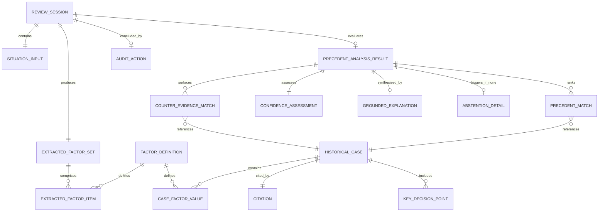

# PRECEDENT — Document 2: Data Model & Schema Specification
**Reference Documents:** `docs/01_SYSTEM_ARCHITECTURE.md`, `PROJECT_CONSTITUTION.md`, `IBM2.pdf`   

---

## 1. Data Modeling Philosophy & Integrity Guardrails

The PRECEDENT data model is the deterministic foundation of the entire system. It is designed around four core principles:

1. **Fixed Categorical Ontology:** Risk factors are strictly partitioned into 4 categories with exactly 2 factors each (8 factors total). This prevents factor explosion and guarantees consistent evaluation.
2. **Immutability of Historical Ground Truth:** Historical case entities and citations represent immutable, peer-reviewed engineering history. They cannot be modified at runtime.
3. **Traceable Human-in-the-Loop State:** All AI extractions are explicitly tracked with confidence excerpts and flags indicating whether an engineer accepted or overrode the extracted factor.
4. **Zero-Fabrication Validation:** Strict typing and Pydantic v2 schemas reject any ungrounded citation, missing source reference, or fabricated factor.

---

## 2. Entity Relationship Diagram (ERD)



---

## 3. The 8-Factor Domain Schema

The core domain ontology consists of 4 categories, each containing exactly 2 boolean/scalar factors:

| Category ID | Category Name | Factor ID | Type | Factor Description & Review Diagnostic Question |
| :--- | :--- | :--- | :--- | :--- |
| `CAT_TECH` | **Technical State** | `known_unresolved_issue` | `boolean` | Is there a known, recurring, or unresolved hardware/software anomaly present in the system? |
| `CAT_TECH` | **Technical State** | `safety_margin_degraded` | `boolean` | Is the system operating outside tested thermal, structural, or environmental safety margins? |
| `CAT_ENV` | **Decision Environment** | `schedule_pressure` | `enum` (`"LOW"`, `"MEDIUM"`, `"HIGH"`) | Is there external launch window, commercial, or public schedule pressure influencing the review? |
| `CAT_ENV` | **Decision Environment** | `external_conditions_marginal` | `boolean` | Are environmental conditions (ambient temp, sea state, space weather) near or outside design limits? |
| `CAT_HUMAN` | **Human Factors** | `dissent_raised_and_overridden` | `boolean` | Did an engineering team, subsystem lead, or contractor raise formal or informal dissent that was overruled? |
| `CAT_HUMAN` | **Human Factors** | `missing_evidence_acknowledged` | `boolean` | Did the board acknowledge missing telemetry, inconclusive test data, or unproven assumptions but proceed anyway? |
| `CAT_PROCESS` | **Process Quality** | `prior_normalization_of_risk` | `boolean` | Has this identical or similar anomaly occurred on prior flights and been accepted as "acceptable risk"? |
| `CAT_PROCESS` | **Process Quality** | `independent_review_skipped` | `boolean` | Was an independent technical review, peer verification, or mandatory safety escalation bypassed or accelerated? |

---

## 4. Detailed Entity Specifications

### 4.1 Citation
Official documentation source validating the historical facts of an incident.

- **Attributes:**
  - `id` (`string`, UUID / slug): Unique citation identifier (e.g., `CIT-ROGERS-1986`).
  - `report_title` (`string`): Full title of the official investigation report.
  - `issuing_body` (`string`): Official commission or agency (e.g., "Presidential Commission on the Space Shuttle Challenger Accident").
  - `publication_year` (`integer`): Year published.
  - `document_number` (`string`, optional): Official report identifier (e.g., "NASA-TM-100234").
  - `public_url` (`string`, URL): Verified public archive URL (NASA NTRS, govinfo.gov, etc.).
  - `key_excerpts` (`array[string]`): Verbatim factual findings cited by the case.

### 4.2 Historical Case
Immutable record of a historical aerospace mission incident (failure or near-miss).

- **Attributes:**
  - `id` (`string`): Unique case identifier (e.g., `CASE-HIST-CHALLENGER-1986`).
  - `case_name` (`string`): Common incident name (e.g., "Space Shuttle Challenger (STS-51-L)").
  - `mission_program` (`string`): Program/vehicle (e.g., "Space Shuttle Program / STS").
  - `incident_date` (`string`, ISO 8601 Date: `YYYY-MM-DD`): Date of the event.
  - `outcome_type` (`enum`): `"CATASTROPHIC_FAILURE"` | `"MISSION_LOSS"` | `"NEAR_MISS_RECOVERED"` (Counter-evidence).
  - `situation_summary` (`string`): Paraphrased 2-3 paragraph engineering overview of the situation leading up to the decision.
  - `factors` (`map[FactorID, FactorCaseEvidence]`): The 8 factor values tagged for this case with specific historical evidence notes.
  - `key_decision_points` (`array[KeyDecisionPoint]`): Critical review/operational decisions made during the mission.
  - `prevention_takeaways` (`array[string]`): Documented engineering catch/prevention lessons.
  - `citation` (`Citation`): Primary official investigation report citation.
  - `secondary_citations` (`array[Citation]`): Supplementary public references.

### 4.3 Situation Input (Review Session Submission)
The live engineering situation submitted to PRECEDENT for evaluation.

- **Attributes:**
  - `situation_id` (`string`, UUID): Unique situation submission ID.
  - `title` (`string`): Short summary title (e.g., "LOX Turbopump Seal Margin Anomaly - FRR").
  - `mission_context` (`string`): Mission name, vehicle stage, or review board type.
  - `raw_description` (`string`): Unstructured narrative text entered by the engineer describing the current issue, dissent, conditions, and history.
  - `initial_factors` (`map[FactorID, any]`, optional): Structured factor toggles explicitly provided by the user upfront.

### 4.4 Extracted Factor Set (Human-in-the-Loop)
Represents the state of factor extraction from the free-text situation, capturing Granite extractions and human overrides.

- **Attributes:**
  - `factors` (`map[FactorID, ExtractedFactorItem]`):
    - `factor_id` (`string`): Target factor ID.
    - `value` (`boolean` | `enum`): Final effective factor value.
    - `extracted_value` (`boolean` | `enum` | `null`): Value extracted by IBM Granite.
    - `confidence` (`float`, 0.0–1.0): Granite extraction confidence.
    - `evidence_quote` (`string` | `null`): Direct quote from the situation text justifying the extracted value.
    - `is_user_modified` (`boolean`): `true` if the engineer modified the Granite-extracted value.
    - `modification_reason` (`string` | `null`): Optional engineer note for the override.

### 4.5 Precedent Match & Analysis Result
Deterministic matching output comparing the confirmed situation factors against the historical case base.

- **Attributes:**
  - `session_id` (`string`, UUID): Reference to the review session.
  - `status` (`enum`): `"PRECEDENT_FOUND"` | `"NO_STRONG_PRECEDENT"` (Abstention).
  - `matched_cases` (`array[PrecedentMatch]`): Ranked list of matching failure cases.
    - `case_id` (`string`): Matched case identifier.
    - `case_name` (`string`): Matched case title.
    - `overlap_count` (`integer`): Number of overlapping active risk factors (0–8).
    - `category_overlap` (`map[CategoryID, integer]`): Overlap count per category.
    - `shared_factors` (`array[SharedFactorDetail]`): Specific factor IDs matching, with current situation context vs. historical case context.
    - `differing_factors` (`array[DifferingFactorDetail]`): Specific factor IDs differing, clarifying boundaries.
    - `citation` (`Citation`): Official report citation.
  - `counter_evidence` (`array[CounterEvidenceMatch]`): Matched safe/recovered precedents sharing similar initial risks.
    - `case_id` (`string`): Counter-case identifier.
    - `case_name` (`string`): Counter-case title.
    - `shared_risk_factors` (`array[string]`): Overlapping risk factors.
    - `divergent_corrective_action` (`string`): What positive action prevented the failure (e.g., independent review, scrub).
    - `citation` (`Citation`): Official report citation.
  - `confidence` (`ConfidenceAssessment`):
    - `level` (`enum`): `"HIGH"` | `"MEDIUM"` | `"LOW"` | `"NONE"`.
    - `overlap_metric` (`string`): Plain-language metric (e.g., "3 of 4 active risk factors match").
    - `rationale` (`string`): Deterministic explanation of the confidence level.
  - `grounded_explanation` (`GroundedExplanation` | `null`): Granite-synthesized contextual narrative (null if abstaining or AI failed).
    - `grounded_narrative` (`string`): 3-paragraph plain-language engineering comparison.
    - `grounded_facts_used` (`array[string]`): Verbatim verified facts injected into the prompt.
    - `model_id` (`string`): e.g., `ibm/granite-3-8b-instruct`.
    - `generated_at` (`string`, ISO 8601 Timestamp).
  - `disclaimer` (`string`): Mandatory second-opinion statement: *"PRECEDENT provides historical precedent analysis for engineering review boards. It is not a recommendation, predictive model, or GO/NO-GO determination. Engineering judgment remains final."*

### 4.6 Review Audit Action
Persistent record of the engineer's final interaction with the precedent flag.

- **Attributes:**
  - `session_id` (`string`, UUID): Unique review session reference.
  - `action` (`enum`): `"ACKNOWLEDGED"` | `"DISMISSED"`.
  - `engineer_notes` (`string` | `null`): Review board rationale or mitigation notes entered by the engineer.
  - `recorded_at` (`string`, ISO 8601 Timestamp).

---

## 5. TypeScript Interfaces (Frontend Contract)

```typescript
/**
 * PRECEDENT Domain TypeScript Interfaces
 * Strictly conforms to docs/01_SYSTEM_ARCHITECTURE.md
 */

export type FactorCategoryID = 'CAT_TECH' | 'CAT_ENV' | 'CAT_HUMAN' | 'CAT_PROCESS';

export type SchedulePressureLevel = 'LOW' | 'MEDIUM' | 'HIGH';

export type CaseOutcomeType = 
  | 'CATASTROPHIC_FAILURE' 
  | 'MISSION_LOSS' 
  | 'NEAR_MISS_RECOVERED';

export type ConfidenceLevel = 'HIGH' | 'MEDIUM' | 'LOW' | 'NONE';

export type ReviewStatus = 'PRECEDENT_FOUND' | 'NO_STRONG_PRECEDENT';

export type AuditActionType = 'ACKNOWLEDGED' | 'DISMISSED';

export interface Citation {
  id: string;
  report_title: string;
  issuing_body: string;
  publication_year: number;
  document_number?: string;
  public_url: string;
  key_excerpts: string[];
}

export interface FactorDefinition {
  id: string;
  category_id: FactorCategoryID;
  category_name: string;
  label: string;
  description: string;
  diagnostic_question: string;
  value_type: 'boolean' | 'enum_schedule';
}

export interface FactorCaseEvidence {
  value: boolean | SchedulePressureLevel;
  evidence_summary: string;
  source_quote?: string;
}

export interface KeyDecisionPoint {
  order: number;
  timestamp_or_phase: string;
  decision_description: string;
  participating_roles: string[];
  outcome_impact: string;
}

export interface HistoricalCase {
  id: string;
  case_name: string;
  mission_program: string;
  incident_date: string; // ISO YYYY-MM-DD
  outcome_type: CaseOutcomeType;
  situation_summary: string;
  factors: Record<string, FactorCaseEvidence>;
  key_decision_points: KeyDecisionPoint[];
  prevention_takeaways: string[];
  citation: Citation;
  secondary_citations: Citation[];
}

export interface SituationInput {
  situation_id?: string;
  title: string;
  mission_context: string;
  raw_description: string;
  initial_factors?: Record<string, boolean | SchedulePressureLevel>;
}

export interface ExtractedFactorItem {
  factor_id: string;
  value: boolean | SchedulePressureLevel;
  extracted_value: boolean | SchedulePressureLevel | null;
  confidence: number;
  evidence_quote: string | null;
  is_user_modified: boolean;
  modification_reason: string | null;
}

export interface ExtractedFactorSet {
  factors: Record<string, ExtractedFactorItem>;
  extraction_model?: string;
  extracted_at: string;
}

export interface SharedFactorDetail {
  factor_id: string;
  factor_label: string;
  category_id: FactorCategoryID;
  situation_evidence: string;
  historical_case_evidence: string;
}

export interface DifferingFactorDetail {
  factor_id: string;
  factor_label: string;
  category_id: FactorCategoryID;
  situation_value: boolean | SchedulePressureLevel;
  case_value: boolean | SchedulePressureLevel;
  contrast_note: string;
}

export interface PrecedentMatch {
  case_id: string;
  case_name: string;
  mission_program: string;
  incident_date: string;
  outcome_type: CaseOutcomeType;
  overlap_count: number;
  total_active_situation_factors: number;
  category_overlap: Record<FactorCategoryID, number>;
  shared_factors: SharedFactorDetail[];
  differing_factors: DifferingFactorDetail[];
  citation: Citation;
}

export interface CounterEvidenceMatch {
  case_id: string;
  case_name: string;
  mission_program: string;
  incident_date: string;
  shared_risk_factors: string[];
  divergent_corrective_action: string;
  prevention_takeaways: string[];
  citation: Citation;
}

export interface ConfidenceAssessment {
  level: ConfidenceLevel;
  overlap_metric: string;
  matched_critical_factors_count: number;
  total_critical_factors_count: number;
  rationale: string;
}

export interface GroundedExplanation {
  grounded_narrative: string;
  grounded_facts_used: string[];
  model_id: string;
  generated_at: string;
}

export interface AbstentionDetail {
  is_abstaining: true;
  reason_code: 'INSUFFICIENT_FACTOR_OVERLAP' | 'SPARSE_INPUT_DATA';
  message: string;
  highest_overlap_found: number;
  minimum_threshold_required: number;
  closest_candidate_cases: Array<{
    case_id: string;
    case_name: string;
    overlap_count: number;
  }>;
}

export interface PrecedentAnalysisResult {
  session_id: string;
  status: ReviewStatus;
  matched_cases: PrecedentMatch[];
  counter_evidence: CounterEvidenceMatch[];
  confidence: ConfidenceAssessment;
  grounded_explanation: GroundedExplanation | null;
  abstention_detail: AbstentionDetail | null;
  evaluated_at: string;
  disclaimer: string;
}

export interface AuditActionRequest {
  session_id: string;
  action: AuditActionType;
  engineer_notes?: string;
}

export interface AuditActionResponse {
  session_id: string;
  action: AuditActionType;
  recorded_at: string;
  status: 'SUCCESS';
}

export interface ReviewSessionSummary {
  session_id: string;
  created_at: string;
  title: string;
  mission_context: string;
  status: ReviewStatus;
  top_matched_case_name: string | null;
  confidence_level: ConfidenceLevel;
  audit_action: AuditActionType | 'PENDING';
}
```

---

## 6. Python Pydantic v2 Models (Backend Contract)

```python
"""
PRECEDENT Backend Domain & DTO Models (Pydantic v2)
Strictly adheres to docs/01_SYSTEM_ARCHITECTURE.md and PROJECT_CONSTITUTION.md
"""

from datetime import datetime, date
from enum import Enum
from typing import Dict, List, Optional, Union, Literal
from pydantic import BaseModel, Field, HttpUrl, field_validator, model_validator


class FactorCategoryID(str, Enum):
    CAT_TECH = "CAT_TECH"
    CAT_ENV = "CAT_ENV"
    CAT_HUMAN = "CAT_HUMAN"
    CAT_PROCESS = "CAT_PROCESS"


class SchedulePressureLevel(str, Enum):
    LOW = "LOW"
    MEDIUM = "MEDIUM"
    HIGH = "HIGH"


class CaseOutcomeType(str, Enum):
    CATASTROPHIC_FAILURE = "CATASTROPHIC_FAILURE"
    MISSION_LOSS = "MISSION_LOSS"
    NEAR_MISS_RECOVERED = "NEAR_MISS_RECOVERED"


class ConfidenceLevel(str, Enum):
    HIGH = "HIGH"
    MEDIUM = "MEDIUM"
    LOW = "LOW"
    NONE = "NONE"


class ReviewStatus(str, Enum):
    PRECEDENT_FOUND = "PRECEDENT_FOUND"
    NO_STRONG_PRECEDENT = "NO_STRONG_PRECEDENT"


class AuditActionType(str, Enum):
    ACKNOWLEDGED = "ACKNOWLEDGED"
    DISMISSED = "DISMISSED"


class Citation(BaseModel):
    id: str = Field(..., description="Unique citation key, e.g. CIT-ROGERS-1986")
    report_title: str = Field(..., min_length=5, description="Full formal title of investigation report")
    issuing_body: str = Field(..., min_length=2, description="Commission or agency")
    publication_year: int = Field(..., ge=1950, le=2030)
    document_number: Optional[str] = None
    public_url: str = Field(..., description="Valid public web link to official archive")
    key_excerpts: List[str] = Field(default_factory=list, description="Verbatim factual excerpts")


class FactorCaseEvidence(BaseModel):
    value: Union[bool, SchedulePressureLevel]
    evidence_summary: str = Field(..., min_length=5)
    source_quote: Optional[str] = None


class KeyDecisionPoint(BaseModel):
    order: int
    timestamp_or_phase: str
    decision_description: str
    participating_roles: List[str]
    outcome_impact: str


class HistoricalCase(BaseModel):
    id: str = Field(..., pattern=r"^CASE-[A-Z0-9\-]+$")
    case_name: str = Field(..., min_length=3)
    mission_program: str
    incident_date: date
    outcome_type: CaseOutcomeType
    situation_summary: str = Field(..., min_length=20)
    factors: Dict[str, FactorCaseEvidence] = Field(..., description="8 fixed factors keyed by ID")
    key_decision_points: List[KeyDecisionPoint] = Field(default_factory=list)
    prevention_takeaways: List[str] = Field(default_factory=list)
    citation: Citation
    secondary_citations: List[Citation] = Field(default_factory=list)

    @field_validator("factors")
    @classmethod
    def validate_factors_count(cls, v: Dict[str, FactorCaseEvidence]) -> Dict[str, FactorCaseEvidence]:
        required_factors = {
            "known_unresolved_issue",
            "safety_margin_degraded",
            "schedule_pressure",
            "external_conditions_marginal",
            "dissent_raised_and_overridden",
            "missing_evidence_acknowledged",
            "prior_normalization_of_risk",
            "independent_review_skipped",
        }
        missing = required_factors - set(v.keys())
        if missing:
            raise ValueError(f"Historical case missing mandatory factors: {missing}")
        return v


class SituationInputRequest(BaseModel):
    title: str = Field(..., min_length=3, max_length=150)
    mission_context: str = Field(..., min_length=2, max_length=100)
    raw_description: str = Field(..., min_length=10, max_length=4000)
    initial_factors: Optional[Dict[str, Union[bool, SchedulePressureLevel]]] = None


class ExtractedFactorItem(BaseModel):
    factor_id: str
    value: Union[bool, SchedulePressureLevel]
    extracted_value: Optional[Union[bool, SchedulePressureLevel]] = None
    confidence: float = Field(ge=0.0, le=1.0)
    evidence_quote: Optional[str] = None
    is_user_modified: bool = False
    modification_reason: Optional[str] = None


class ExtractFactorsResponse(BaseModel):
    session_id: str
    factors: Dict[str, ExtractedFactorItem]
    model_id: str
    extracted_at: datetime = Field(default_factory=datetime.utcnow)


class SharedFactorDetail(BaseModel):
    factor_id: str
    factor_label: str
    category_id: FactorCategoryID
    situation_evidence: str
    historical_case_evidence: str


class DifferingFactorDetail(BaseModel):
    factor_id: str
    factor_label: str
    category_id: FactorCategoryID
    situation_value: Union[bool, SchedulePressureLevel]
    case_value: Union[bool, SchedulePressureLevel]
    contrast_note: str


class PrecedentMatch(BaseModel):
    case_id: str
    case_name: str
    mission_program: str
    incident_date: date
    outcome_type: CaseOutcomeType
    overlap_count: int = Field(ge=0, le=8)
    total_active_situation_factors: int
    category_overlap: Dict[FactorCategoryID, int]
    shared_factors: List[SharedFactorDetail]
    differing_factors: List[DifferingFactorDetail]
    citation: Citation


class CounterEvidenceMatch(BaseModel):
    case_id: str
    case_name: str
    mission_program: str
    incident_date: date
    shared_risk_factors: List[str]
    divergent_corrective_action: str
    prevention_takeaways: List[str]
    citation: Citation


class ConfidenceAssessment(BaseModel):
    level: ConfidenceLevel
    overlap_metric: str
    matched_critical_factors_count: int
    total_critical_factors_count: int
    rationale: str


class GroundedExplanation(BaseModel):
    grounded_narrative: str = Field(..., min_length=20)
    grounded_facts_used: List[str] = Field(default_factory=list)
    model_id: str
    generated_at: datetime = Field(default_factory=datetime.utcnow)


class AbstentionDetail(BaseModel):
    is_abstaining: Literal[True] = True
    reason_code: Literal["INSUFFICIENT_FACTOR_OVERLAP", "SPARSE_INPUT_DATA"]
    message: str
    highest_overlap_found: int
    minimum_threshold_required: int
    closest_candidate_cases: List[Dict[str, Union[str, int]]] = Field(default_factory=list)


class EvaluatePrecedentRequest(BaseModel):
    session_id: str
    situation_title: str
    situation_summary: str
    confirmed_factors: Dict[str, Union[bool, SchedulePressureLevel]]


class PrecedentAnalysisResult(BaseModel):
    session_id: str
    status: ReviewStatus
    matched_cases: List[PrecedentMatch]
    counter_evidence: List[CounterEvidenceMatch]
    confidence: ConfidenceAssessment
    grounded_explanation: Optional[GroundedExplanation] = None
    abstention_detail: Optional[AbstentionDetail] = None
    evaluated_at: datetime = Field(default_factory=datetime.utcnow)
    disclaimer: str = (
        "PRECEDENT provides historical precedent analysis for engineering review boards. "
        "It is not a recommendation, predictive model, or GO/NO-GO determination. "
        "Engineering judgment remains final."
    )


class AuditActionRequest(BaseModel):
    session_id: str
    action: AuditActionType
    engineer_notes: Optional[str] = None


class AuditActionResponse(BaseModel):
    session_id: str
    action: AuditActionType
    recorded_at: datetime = Field(default_factory=datetime.utcnow)
    status: Literal["SUCCESS"] = "SUCCESS"
```

---

## 7. JSON Schema Validation Strategy

### 7.1 Input Validation Rules
1. **Schema Whitelisting:** Any request containing factor keys outside the fixed 8 factors will fail validation (`extra = 'forbid'`).
2. **Text Sanitation & Bounding:** `raw_description` is capped at 4,000 characters to prevent buffer saturation and unbounded LLM context tokens.
3. **Pydantic Strict Coercion:** Boolean fields strictly accept `true`/`false`; `schedule_pressure` strictly accepts uppercase `"LOW"`, `"MEDIUM"`, `"HIGH"`.

### 7.2 AI Output Validation Rules
When IBM Granite returns JSON for factor extraction:
1. The backend parses the raw LLM response through `pydantic.TypeAdapter(Dict[str, ExtractedFactorItem])`.
2. If Granite returns markdown code blocks (e.g. ````json ... ````), a pre-parsing sanitizer strips framing before schema ingestion.
3. If JSON validation fails or an unknown factor is returned, the backend triggers the **Granite Extraction Fallback** (returning defaults with `confidence=0.0` and prompting the user for manual factor confirmation).

---

## 8. Concrete Seed Data Examples

### 8.1 Historical Failure Case: Challenger STS-51-L (`cases.json`)

```json
{
  "id": "CASE-HIST-CHALLENGER-1986",
  "case_name": "Space Shuttle Challenger (STS-51-L)",
  "mission_program": "Space Transportation System (STS)",
  "incident_date": "1986-01-28",
  "outcome_type": "CATASTROPHIC_FAILURE",
  "situation_summary": "Prior to the launch of STS-51-L, Morton Thiokol engineers recommended against launching at ambient temperatures below 53°F due to primary O-ring resiliency data. NASA and contractor management engaged in an offline caucus where Thiokol management was told to 'put on their management hats,' overruling the engineering recommendation without new technical data.",
  "factors": {
    "known_unresolved_issue": {
      "value": true,
      "evidence_summary": "O-ring erosion and blow-by had been documented on multiple previous shuttle flights (e.g. STS-51-C).",
      "source_quote": "The decision to launch was based on a flawed engineering rationale that accepted O-ring erosion as an acceptable risk."
    },
    "safety_margin_degraded": {
      "value": true,
      "evidence_summary": "Forecasted launch temperature was 29°F, far below the tested operational envelope of 53°F.",
      "source_quote": "Temperature was a determining factor in O-ring resiliency."
    },
    "schedule_pressure": {
      "value": "HIGH",
      "evidence_summary": "High launch cadence commitments, Teacher in Space media event, and upcoming planetary launch windows.",
      "source_quote": "NASA was operating under severe schedule pressure to maintain the flight schedule."
    },
    "external_conditions_marginal": {
      "value": true,
      "evidence_summary": "Sub-freezing ambient temperature (29°F) and severe launch pad ice formations.",
      "source_quote": "Unprecedented low temperatures at Launch Complex 39B."
    },
    "dissent_raised_and_overridden": {
      "value": true,
      "evidence_summary": "Morton Thiokol propulsion engineers (Boisjoly, Thompson) formally objected to launch but were overruled by Thiokol management.",
      "source_quote": "Thiokol management reversed their initial recommendation to not launch after NASA pressure."
    },
    "missing_evidence_acknowledged": {
      "value": true,
      "evidence_summary": "Absence of low-temperature O-ring test data was interpreted as proof of safety rather than reason for pause.",
      "source_quote": "NASA shifted the burden of proof to requiring engineers to prove it was unsafe to fly."
    },
    "prior_normalization_of_risk": {
      "value": true,
      "evidence_summary": "Previous O-ring blow-by events were classified as 'acceptable flight risk' because secondary O-rings held.",
      "source_quote": "The phenomenon of normalization of deviance."
    },
    "independent_review_skipped": {
      "value": true,
      "evidence_summary": "The Level III / Level IV teleconference dissent was never escalated to Level I / Level II Mission Management.",
      "source_quote": "Key decision makers were not informed of the contractor engineers' vigorous opposition."
    }
  },
  "key_decision_points": [
    {
      "order": 1,
      "timestamp_or_phase": "1986-01-27 20:15 EST",
      "decision_description": "Initial teleconference: Thiokol engineers recommend no launch below 53°F.",
      "participating_roles": ["Thiokol Engineers", "MSFC Project Managers"],
      "outcome_impact": "NASA MSFC managers contest recommendation and demand justification."
    },
    {
      "order": 2,
      "timestamp_or_phase": "1986-01-27 22:30 EST",
      "decision_description": "Thiokol offline management caucus: Management overrules engineering staff.",
      "participating_roles": ["Thiokol Senior Executives"],
      "outcome_impact": "Formal sign-off transmitted approving launch."
    }
  ],
  "prevention_takeaways": [
    "Never shift the burden of proof from 'prove it is safe' to 'prove it will fail'.",
    "Require mandatory escalation of contractor technical dissent to Level I flight directors.",
    "Do not treat recurring anomalies as evidence of safety margin."
  ],
  "citation": {
    "id": "CIT-ROGERS-1986",
    "report_title": "Report of the Presidential Commission on the Space Shuttle Challenger Accident",
    "issuing_body": "Presidential Commission (Rogers Commission)",
    "publication_year": 1986,
    "document_number": "PC-STS-51L-1986",
    "public_url": "https://history.nasa.gov/rogersrep/genindex.htm",
    "key_excerpts": [
      "The failure was due to a breakdown in the decision-making process at NASA and Thiokol.",
      "A known defect had been accepted as an acceptable flight risk."
    ]
  },
  "secondary_citations": []
}
```

### 8.2 Historical Counter-Evidence Case: STS-27 Thermal Tile Anomaly (`cases.json`)

```json
{
  "id": "CASE-HIST-STS27-1988",
  "case_name": "Space Shuttle Atlantis (STS-27) Tile Damage",
  "mission_program": "Space Transportation System (STS)",
  "incident_date": "1988-12-02",
  "outcome_type": "NEAR_MISS_RECOVERED",
  "situation_summary": "During ascent, ablative nose cone insulation from the right Solid Rocket Booster struck the orbiter, damaging over 700 thermal protection tiles. Crew inspection via robotic arm camera showed missing and severely ablated tiles. Mission Control reviewed encrypted video and classified data. Commander Hoot Gibson ordered conservative reentry profile and prepared contingency protocols, leading to safe landing.",
  "factors": {
    "known_unresolved_issue": {
      "value": true,
      "evidence_summary": "Debris shedding from SRB nose cones had occurred on prior flights.",
      "source_quote": "Ablative material shedding was a known debris source."
    },
    "safety_margin_degraded": {
      "value": true,
      "evidence_summary": "One L-band antenna tile was completely missing, exposing bare steel structure.",
      "source_quote": "Structural burn-through risk was elevated."
    },
    "schedule_pressure": {
      "value": "LOW",
      "evidence_summary": "DoD classified mission with on-orbit contingency time available.",
      "source_quote": "Mission timeline was adaptable."
    },
    "external_conditions_marginal": {
      "value": false,
      "evidence_summary": "Nominal ascent and orbital environmental conditions.",
      "source_quote": "Space weather and orbit were nominal."
    },
    "dissent_raised_and_overridden": {
      "value": false,
      "evidence_summary": "Crew and ground engineers engaged in transparent, non-hostile review of camera footage.",
      "source_quote": "Open communication maintained between crew and flight directors."
    },
    "missing_evidence_acknowledged": {
      "value": true,
      "evidence_summary": "Low-resolution video hindered accurate thermal modeling; crew acknowledged uncertainty.",
      "source_quote": "Image resolution was insufficient for definitive aero-thermal analysis."
    },
    "prior_normalization_of_risk": {
      "value": true,
      "evidence_summary": "Minor tile strikes had been normalized on STS-1 through STS-26.",
      "source_quote": "Foam and ablator strikes were historically treated as maintenance turnaround issues."
    },
    "independent_review_skipped": {
      "value": false,
      "evidence_summary": "Air Force / DoD independent photo-interpreters and NASA thermal engineers cross-verified damage assessments.",
      "source_quote": "Independent photo analysis was conducted before reentry clearance."
    }
  },
  "key_decision_points": [
    {
      "order": 1,
      "timestamp_or_phase": "Flight Day 2",
      "decision_description": "Commander uses RMS arm to survey right wing underside.",
      "participating_roles": ["Crew", "Flight Director"],
      "outcome_impact": "Confirmed severe tile damage and escalated to ground review."
    },
    {
      "order": 2,
      "timestamp_or_phase": "Flight Day 4",
      "decision_description": "Independent photo analysis verifies steel antenna plate intact, enabling safe reentry path.",
      "participating_roles": ["DoD Image Analysts", "NASA Mission Management"],
      "outcome_impact": "Crew executes reentry with verified conservative trajectory; safe landing achieved."
    }
  ],
  "prevention_takeaways": [
    "Independent verification of damage assessments prevents premature dismissal of critical safety margins.",
    "Transparent crew-to-ground risk sharing avoids hierarchical suppression of engineering concerns."
  ],
  "citation": {
    "id": "CIT-NASA-STS27-1988",
    "report_title": "STS-27 Anomaly Investigation and Thermal Tile Impact Assessment",
    "issuing_body": "NASA Johnson Space Center / DoD",
    "publication_year": 1989,
    "document_number": "JSC-STS27-ANOM-01",
    "public_url": "https://www.nasa.gov/missions/shuttle/sts-27/",
    "key_excerpts": [
      "The orbiter survived reentry with severe tile damage due to steel mounting plate resilience.",
      "Independent imagery analysis provided critical confirmation."
    ]
  },
  "secondary_citations": []
}
```

---

## 9. Review Session Audit Log Schema (`sessions.json` / SQLite)

Each review session persists an immutable audit trail:

```json
{
  "session_id": "f47ac10b-58cc-4372-a567-0e02b2c3d479",
  "created_at": "2026-08-07T14:30:00Z",
  "updated_at": "2026-08-07T14:32:15Z",
  "submitter": {
    "role": "Lead Propulsion Safety Engineer",
    "review_board": "Launch Readiness Review (LRR)"
  },
  "input": {
    "title": "Cryogenic LOX Turbopump Seal Margin Degradation",
    "mission_context": "Stage 2 Cryogenic Insertion",
    "raw_description": "During wet dress rehearsal, turbopump seal delta-P showed a 14% drop from nominal qualification baseline. Similar seal weeping was noted on static fire test #2 and accepted. Schedule for launch is critical due to window closing in 48 hours. Propulsion contractor engineer noted concern regarding low ambient thermal margin, but project manager noted prior test passed."
  },
  "extracted_factors": {
    "known_unresolved_issue": { "value": true, "extracted_value": true, "confidence": 0.95, "is_user_modified": false },
    "safety_margin_degraded": { "value": true, "extracted_value": true, "confidence": 0.90, "is_user_modified": false },
    "schedule_pressure": { "value": "HIGH", "extracted_value": "HIGH", "confidence": 0.88, "is_user_modified": false },
    "external_conditions_marginal": { "value": true, "extracted_value": true, "confidence": 0.85, "is_user_modified": false },
    "dissent_raised_and_overridden": { "value": true, "extracted_value": false, "confidence": 0.60, "is_user_modified": true, "modification_reason": "Contractor engineer objection was overruled in morning caucus" },
    "missing_evidence_acknowledged": { "value": false, "extracted_value": false, "confidence": 0.90, "is_user_modified": false },
    "prior_normalization_of_risk": { "value": true, "extracted_value": true, "confidence": 0.92, "is_user_modified": false },
    "independent_review_skipped": { "value": true, "extracted_value": true, "confidence": 0.80, "is_user_modified": false }
  },
  "analysis_result": {
    "status": "PRECEDENT_FOUND",
    "top_match_case_id": "CASE-HIST-CHALLENGER-1986",
    "overlap_count": 6,
    "confidence_level": "HIGH",
    "counter_evidence_found": true
  },
  "audit_action": {
    "action": "ACKNOWLEDGED",
    "engineer_notes": "Board reviewed Challenger precedent regarding contractor dissent and prior test normalization. Convening independent turbopump review board before tanking.",
    "recorded_at": "2026-08-07T14:32:15Z"
  }
}
```

---

## 10. Data Model Freeze

**Data Model Status:** Approved (Frozen Baseline)  

This data model serves as the single source of truth for all domain entities, validation rules, TypeScript interfaces, and backend Pydantic schemas. Any change to these definitions requires explicit review and approval.
