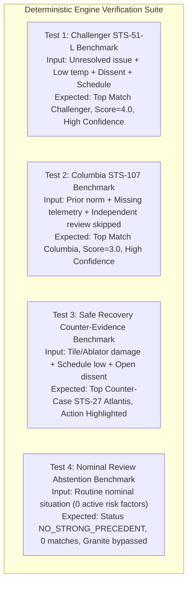

# PRECEDENT — Document 3: Deterministic Reasoning Engine Specification

**Status:** Proposed Engine Design (Pending Review)  
**Author:** Lead Software Architect & Principal AI Engineer  
**Reference Documents:** `docs/01_SYSTEM_ARCHITECTURE.md`, `docs/02_DATA_MODEL.md`, `PROJECT_CONSTITUTION.md`, `IBM2.pdf`  
**Target:** IBM AI Builders Challenge (Space Exploration Track)  

---

## 1. Engine Core Philosophy & Tenets

The PRECEDENT Reasoning Engine is the deterministic intellectual core of the system. It adheres to three strict constitutional tenets:

1. **100% Deterministic Execution:** The retrieval, matching, scoring, ranking, confidence derivation, and counter-evidence association are computed entirely through inspectable, deterministic algorithms. Generative AI (Granite) is never used to rank cases or compute confidence.
2. **Causal Anatomy over Semantic Text Similarity:** Precedent is evaluated based on the shared structural mechanisms of failure (e.g., *unresolved risk accepted under schedule pressure with suppressed engineering dissent*), rather than superficial keyword or text embeddings.
3. **Transparent Discrete Explanations over Continuous Black-Box Scores:** The engine produces explicit lists of **Shared Factors** and **Differing Factors** alongside discrete, plain-language confidence statements (e.g., *"High Confidence — 3 of 4 active decision factors match"*), completely avoiding deceptive, pseudo-precise percentages (e.g., "87.4% match").

---

## 2. Formal Mathematical Formulation

### 2.1 Factor Space Definition
Let $\mathcal{F}$ denote the fixed set of 8 decision factors partitioned into 4 disjoint categories $\mathcal{C} = \{\text{CAT\_TECH}, \text{CAT\_ENV}, \text{CAT\_HUMAN}, \text{CAT\_PROCESS}\}$:

$$\mathcal{F} = \{f_1, f_2, \dots, f_8\}$$

**C_TECH** = { `f_known_unresolved_issue`, `f_safety_margin_degraded` }

**C_ENV** = { `f_schedule_pressure`, `f_external_conditions_marginal` }

**C_HUMAN** = { `f_dissent_raised_and_overridden`, `f_missing_evidence_acknowledged` }

**C_PROCESS** = { `f_prior_normalization_of_risk`, `f_independent_review_skipped` }

### 2.2 Factor Representation Vectors
For any given input situation $S$ and historical case $H^{(c)}$ in the case library $\mathcal{H}$:
- $S[f] \in \{\text{True}, \text{False}\} \cup \{\text{"LOW"}, \text{"MEDIUM"}, \text{"HIGH"}, \text{None}\}$
- $H^{(c)}[f] \in \{\text{True}, \text{False}\} \cup \{\text{"LOW"}, \text{"MEDIUM"}, \text{"HIGH"}\}$

Let $\mathcal{F}_{\text{active}}(S)$ be the set of active risk factors present in the current situation:
$$\mathcal{F}_{\text{active}}(S) = \{f \in \mathcal{F} \mid \text{IsRiskActive}(S[f]) = \text{True}\}$$

Where:
$$\text{IsRiskActive}(v) = \begin{cases} 
\text{True} & \text{if } v = \text{True} \\
\text{True} & \text{if } v \in \{\text{"MEDIUM"}, \text{"HIGH"}\} \\
\text{False} & \text{if } v \in \{\text{False}, \text{"LOW"}, \text{None}\}
\end{cases}$$

---

## 3. Factor Comparison Semantics

### 3.1 Factor Match Function $\mu(S[f], H[f])$
The match value between a situation factor and a historical case factor is evaluated as follows:

1. **For Boolean Factors ($f \neq$ `schedule_pressure`):**
   $$\mu(S[f], H[f]) = \begin{cases} 
   1.0 & \text{if } S[f] = \text{True} \land H[f] = \text{True} \quad (\text{Shared Active Risk}) \\
   0.0 & \text{otherwise}
   \end{cases}$$
   *(Note: Two factors that are both `False` are NOT counted as shared risk factors, preventing false similarity scores on nominal flags).*

2. **For Schedule Pressure ($f =$ `schedule_pressure`):**
   | Situation Value ($S[f]$) | Case Value ($H[f]$) | Match Value $\mu$ | Interpretation |
   | :--- | :--- | :---: | :--- |
   | `"HIGH"` | `"HIGH"` | **1.0** | Full match on acute schedule pressure |
   | `"MEDIUM"` | `"HIGH"` | **0.5** | Partial match on elevated schedule pressure |
   | `"HIGH"` | `"MEDIUM"` | **0.5** | Partial match on elevated schedule pressure |
   | `"MEDIUM"` | `"MEDIUM"` | **0.5** | Moderate schedule pressure present |
   | `"LOW"` / `None` | Any | **0.0** | No active schedule risk in situation |
   | Any | `"LOW"` | **0.0** | Case had no elevated schedule pressure |

---

## 4. Shared vs. Differing Factor Classification

For every historical case $H^{(c)}$, the engine partitions all 8 factors into two distinct, inspectable sets:

### 4.1 Shared Factors Set ($\mathcal{F}_{\text{shared}}$)
Factors where both the current situation and the historical case exhibit the active risk condition:
$$\mathcal{F}_{\text{shared}}(S, H^{(c)}) = \{f \in \mathcal{F} \mid \mu(S[f], H^{(c)}[f]) > 0\}$$
- Each shared factor is decorated with:
  - `situation_evidence`: The specific situation context or quote.
  - `historical_case_evidence`: The verified finding from the investigation board report.

### 4.2 Differing Factors Set ($\mathcal{F}_{\text{differing}}$)
Factors where the current situation and the historical case diverge, establishing the boundaries of the analogy:
$$\mathcal{F}_{\text{differing}}(S, H^{(c)}) = \{f \in \mathcal{F} \mid \text{IsRiskActive}(S[f]) \neq \text{IsRiskActive}(H^{(c)}[f])\}$$
- Each differing factor is decorated with a clear contrast note (e.g., *"Contractor dissent was present in Challenger, but formal dissent has not been registered in the current review"*).

---

## 5. Scoring, Category Breadth & Ranking Algorithm

### 5.1 Overlap Score Formulation
The raw overlap score is the sum of factor match values:
$$\text{Score}_{\text{overlap}}(S, H^{(c)}) = \sum_{f \in \mathcal{F}} \mu(S[f], H^{(c)}[f])$$

### 5.2 Category Breadth Metric
To prevent localized false positives (e.g., matching 2 factors in only Technical State while completely missing organizational dynamics), the engine computes **Category Breadth** $B(S, H^{(c)})$:

$$B(S, H^{(c)}) = | \{ C \in \mathcal{C} \mid \exists f \in C \text{ such that } \mu(S[f], H^{(c)}[f]) > 0 \} |$$
*(Where $B \in \{0, 1, 2, 3, 4\}$, representing the number of distinct categories with at least one matching risk factor).*

### 5.3 Lexicographical Ranking Key
Historical failure cases are ranked using a strict, deterministic 4-tuple:

$$\text{RankKey}(H^{(c)}) = \Big( \text{Score}_{\text{overlap}}(S, H^{(c)}), \; B(S, H^{(c)}), \; -\text{Overmatch}(S, H^{(c)}), \; \text{Score}_{\text{org}}(S, H^{(c)}) \Big)$$

Where $\text{Overmatch}(S, H^{(c)})$ represents historical overmatch (the number of active risk factors documented in the historical case that are not present in the current situation profile). It is inverted ($-$) to penalize cases with excessive unrelated historical risk factors.

And $\text{Score}_{\text{org}}$ is the organizational failure factor score:
**Score_org**(S, H^{(c)}) = μ(S[`f_dissent`], H^{(c)}[`f_dissent`]) + μ(S[`f_prior_norm`], H^{(c)}[`f_prior_norm`])

**Why this ranking order is chosen:**
1. $\text{Score}_{\text{overlap}}$ ensures the case with the greatest total risk factor alignment ranks highest.
2. $B(S, H^{(c)})$ breaks ties by rewarding multi-dimensional causal alignment (e.g., technical + organizational failure over purely technical similarity).
3. $-\text{Overmatch}(S, H^{(c)})$ penalizes historical cases that have many active risks not present in the current situation, ensuring the most precise analogy ranks higher.
4. $\text{Score}_{\text{org}}$ acts as the final tie-breaker, prioritizing the two root organizational failure modes (*dissent overruled* and *normalization of deviance*) documented as primary causes across Challenger, Columbia, and Apollo 1.

---

## 6. Confidence Calculation Strategy

PRECEDENT avoids fabricated percentage metrics. Confidence is computed as a discrete level accompanied by an explicit plain-language rationale:

```
┌────────────────────────────────────────────────────────────────────────┐
│                     CONFIDENCE DETERMINATION TABLE                     │
├──────────┬─────────────────────────────────────────────────────────────┤
│  LEVEL   │ DETERMINISTIC CRITERIA                                      │
├──────────┼─────────────────────────────────────────────────────────────┤
│   HIGH   │ Score_overlap ≥ 3.0 AND Category Breadth B ≥ 2             │
│          │ OR (Score_overlap ≥ 2.0 AND Score_overlap ≥ |F_active(S)|)  │
├──────────┼─────────────────────────────────────────────────────────────┤
│  MEDIUM  │ Score_overlap ≥ 2.0 AND Category Breadth B ≥ 1             │
│          │ OR (Score_overlap ≥ 1.5 AND Category Breadth B ≥ 2)         │
├──────────┼─────────────────────────────────────────────────────────────┤
│   LOW    │ Score_overlap ≥ 1.0                                        │
├──────────┼─────────────────────────────────────────────────────────────┤
│   NONE   │ Score_overlap = 0.0 OR |F_active(S)| = 0                    │
└──────────┴─────────────────────────────────────────────────────────────┘
```

### Plain-Language Rationale Generation Template
The confidence rationale string is synthesized deterministically using the following formula:

$$\text{Rationale} = \text{"\{Level\} confidence — \{k\} of \{N\} active decision factors match: \{List of shared factor labels\} across \{B\} categories."}$$

*Example Output:*
> **"High confidence — 3 of 4 active decision factors match: Known unresolved issue, Schedule pressure, Dissent raised and overridden across Technical, Environment, and Human categories."**

---

## 7. Tie Handling & Conflicting Cases Policy

When two historical cases produce identical ranking tuples (e.g., Case $A$ and Case $B$ both have $\text{Score}_{\text{overlap}} = 3.0$ and $B = 2$):

1. **No Artificial Winner:** The engine strictly refuses to pick an arbitrary single winner.
2. **Multi-Precedent Presentation:** The engine returns both cases in the `matched_cases` array with equal rank.
3. **Explicit Difference Highlighting:** The UI displays both precedents side-by-side, explicitly showing where their factors diverge:
   - *Example:* Case $A$ (Challenger) matches on *temperature + dissent*, while Case $B$ (Columbia) matches on *schedule pressure + normalization of deviance*.

---

## 8. Missing Data & Sparsity Handling

When the situation input description is brief or the user omits certain structured toggles:

1. **Neutral Evaluation:** Unspecified factors are marked as `None` / `Unassessed`. They are never assumed `False` or `True`.
2. **Missing Information Warning:** If $|\mathcal{F}_{\text{active}}(S)| + |\mathcal{F}_{\text{inactive}}(S)| < 4$, the engine flags a `SPARSE_INPUT_WARNING` in the response metadata:
   > *"Notice: 4 of 8 decision factors were unassessed. Consider confirming Human Factors and Process Quality before finalizing review."*
3. **Zero Active Factors:** If $|\mathcal{F}_{\text{active}}(S)| = 0$, the engine immediately halts matching and triggers an explicit nominal abstention.

---

## 9. Counter-Evidence Discovery Algorithm

Counter-evidence cases are historical missions that encountered similar high-stakes technical or environmental risks, but successfully avoided catastrophic failure due to decisive engineering safeguards.

### Counter-Evidence Retrieval Logic
For a current situation $S$, the engine queries the counter-evidence case library $\mathcal{H}_{\text{counter}}$ using the following rules:

1. **Initial Risk Overlap Condition:**
   The counter-case must share at least one technical or environmental risk factor with the current situation:
   $$\exists f \in \{\mathcal{C}_{\text{TECH}} \cup \mathcal{C}_{\text{ENV}}\} \quad \text{such that } \mu(S[f], H_{\text{counter}}[f]) > 0$$

2. **Divergent Safe Safeguard Condition:**
   The counter-case must have executed a positive safeguard where the failure case failed:
   (H_counter[`f_independent_review_skipped`] == False) ∨ (H_counter[`f_dissent_raised_and_overridden`] == False)

3. **Output Formatting:**
   The engine surfaces the counter-evidence case with its **Divergent Corrective Action** (e.g., *"Independent photo-interpretation team mobilized to verify structural margin prior to reentry clearance"*), proving to the review board that risk can be managed through verification rather than normalized.

---

## 10. Abstention Gating & Fallback Behavior

### 10.1 The Abstention Threshold Rule
To prevent false alarms and forced analogies, the engine enforces a strict abstention gate:

$$\text{TriggerAbstention} \iff \max_{c} \left( \text{Score}_{\text{overlap}}(S, H^{(c)}) \right) < \theta_{\text{abstain}}$$

Where the default abstention threshold is:
$$\theta_{\text{abstain}} = 2.0 \quad (\text{or } 1.0 \text{ if } |\mathcal{F}_{\text{active}}(S)| = 1)$$

### 10.2 Abstention Response Output
When abstention triggers:
1. `status` is set to `"NO_STRONG_PRECEDENT"`.
2. `matched_cases` is returned as empty `[]`.
3. `abstention_detail` contains:
   - `reason_code`: `"INSUFFICIENT_FACTOR_OVERLAP"`.
   - `message`: *"No documented historical aerospace incident shares significant causal factors with the current situation profile."*
   - `highest_overlap_found`: e.g., `1.0`.
   - `closest_candidate_cases`: List of weak partial matches (informational reference only).
4. Generative AI explanation is **bypassed entirely** to avoid hallucinating forced connections.

---

## 11. Verification Test Scenarios (Engine Benchmarks)

The following four benchmark scenarios define the validation acceptance criteria for the deterministic reasoning engine:



---

## 12. Reasoning Engine Freeze

**Engine Design Status:** Proposed (Ready for Review)  

This document formalizes all algorithms, scoring formulas, confidence derivations, tie-breaking policies, and abstention rules. Upon approval, this design becomes frozen and will govern the implementation of `backend/app/services/engine/matcher.py`.
